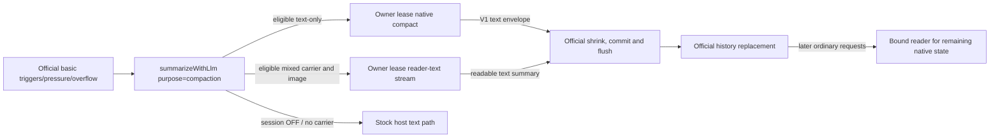

# Official-basic native compaction architecture

`dsh-codex-compaction` `0.3.3` keeps the stock official `BasicCompactionEngine`
as the primary and only automatic compaction backend and adds an optional
account-owned native summarization/replay seam for standard `openai-codex` sessions,
plus the legacy structured reader. The earlier A/B experiment established engineering
feasibility, not a product choice; the structured B direction is now **legacy
compatibility** for pre-existing sessions, not the production path.

## Modules and ownership

1. **Account-owned Codex Runtime** (`dsh-token-usage/lib/capabilities/codex-native`):
   the existing OAuth owner callbacks, immutable connection handles, the pinned native
   catalog with trusted model-facts resolution, normal/native protocol, codec, replay,
   disclosed estimates and the metadata-only `applicability` verdict. No raw
   credentials leave the capability.
2. **Standard-route seam** (`native-seam.js`, `preference-recovery.js`): intercepts
   the official engine's `purpose=compaction` `llm/stream` call per session,
   recognizes only the real official basic instruction tail, binds one owner lease
   (same account/model/endpoint) and allows at most one extra recovery request:
   native retry OR transparent text fallback inside that lease, never both. Histories containing native
   carriers fail closed on every guard branch — they never reach the plain adapter.
   Session preferences survive host restarts by reading the host's own persisted
   public command lifecycle events only.
3. **DSH provider bridge** (`provider-entry.js`, `runtime-adapter.js`,
   `runtime-service.js`): generic public PiAiAdapter conversion, typed source
   validation, unpredictable replay placeholders and the isolated legacy route
   registration. No native SDK, login, HTTP endpoint or credential store exists in
   production compaction source.
4. **Policy entry** (`index.js`): `/codex-native on|off|inherit|status`,
   `/codex-context` (honest observed logical replacement, never an independent
   disk-persistence claim) and the legacy setup command for the archived B preset.
   It can unload without withdrawing the separately mounted provider entry.
5. **Legacy structured engine** (`structured-engine.js`): the archived B backend for
   pre-existing structured sessions — manual-only, `source.nativeCodex` records,
   unchanged behavior.
6. **Host adapters** (`compatibility.js`, `engine-host.js`): public DSH imports and
   the pinned host contract. No private src/lib imports, global fetch replacement or
   core patches.

The package still ships the provider bridge and policy entry together as separate
Cordis rows: logical separation first, not a claim that uninstalling the whole
package keeps the route reader available.

## 0.3.3 image replay repair

The bridge now wires the published PiAiAdapter attachment/access resolvers just like
stock rc.1. Ordinary owner `mode: stream` already converts images, so this change
requires no owner codec/transport extension. The v1 `mode: compact` path remains
text-only, as does legacy structured manual compaction.

For standard Basic requests containing both native carriers and images, the seam
keeps all applicability/preference/instruction guards and opens one compaction-budget
lease. It replays validated opaque state and host-projected images through the same
owner's normal stream, with Basic's instruction intact. Basic receives a **reader-text**
summary and retains responsibility for validation, usage, shrink checks and commit.
This is a deliberate one-request mode, not a retry/failure fallback. Failed or cancelled
summaries cannot authorize history replacement; no plain adapter receives opaque state.
Existing checkpoints and attachment files are not rewritten. Ordinary generation does
not require native creation to be enabled; mixed summarization still requires it.
Missing attachments, unsupported image roles/text-only models, and images embedded in
carrier framing fail closed. Stock request-image projection/offloading limits still apply.

## Standard-route flow

## 0.3.2 + owner 5.1.3 deadline separation

Ordinary owner `open` selects 1800000ms total and 120000ms setup budgets. The owner
retains metadata/auth, transport and total-deadline ownership; the companion simply
configures the existing public PiAiAdapter idle watchdog to 300000ms for replay/text
as well as native compaction. There is no new SSE monitor. Owner deadline errors remain
`CODEX_RUNTIME_TIMEOUT`; converter inactivity remains Pi `TIMEOUT`.

`purpose: 'compaction'` keeps a 300000ms total deadline including setup, without a separate
shorter setup timer. Retries and same-lease fallback never renew it. At the owner factory,
`timeoutMs` remains the total-budget option with explicit short-call semantics;
`setupTimeoutMs` defaults to `min(timeoutMs, 120000)` and `compactionTimeoutMs` to
`min(timeoutMs, 300000)`. These are not per-open caller duration overrides.

Optional diagnostics keep `budgetMs` as the selected total budget and add allowlisted
`totalBudgetMs`, `setupBudgetMs`, `timeoutBudgetMs` and `timeoutKind` (`setup` or `total`).
Only nonnegative safe integers and fixed enums cross the seam, never credentials or bodies.
Old owners and checkpoint readers remain compatible, but a consumer-only update cannot
change an old owner's total cap. The complete fix requires both companion updates.
No publication or live acceptance is claimed for this pair.

## Historical 0.3.1 recovery correction

The owner transport treats a valid completed/done event plus one valid compaction item as the
stream boundary, not HTTP EOF. Premature EOF/socket failure is recoverable RESPONSE_STREAM;
malformed protocol remains non-retryable RESPONSE_PROTOCOL. The first lease stop cause
(TIMEOUT/CANCELLED/CLOSED/DISPOSED) survives handle reuse. Compaction leases and native
converters get 300000ms; ordinary leases and replay/text converters keep 120000ms. Fixed-field
phase/timing/count diagnostics include `budgetMs` and fixed-enum `eventCounts`, not raw data.

`recovery.js` adds bounded process-local admission state to the existing seam: one shared
extra-request budget (native retry OR same-lease text fallback), plus a fixed 60-second
per-session/provider/model interval after terminal failures. Native retry uses 200ms backoff;
it never renews the owner deadline or changes the bound account/model/endpoint. TIMEOUT is
not recoverable on an expired lease. Native-to-text fallback is plugin policy, not an official
Codex behavior claim. Ordinary model calls still pass through unchanged. Official public
compaction start/end and replacement-source events correlate transaction outcomes; a streamed
summary does not reset failures until the matching replacement and clean end are observed.
Skipped/busy/cancelled requests do not extend the interval. No private host mutation or
persistent event type is added.

The accepted real run completed in 157372ms with one request under a 300000ms budget, followed
by official Basic history replacement and disk-journal readback; see [validation](VALIDATION.md).
It does not prove fsync, crash recovery or elimination of all timeouts. Cancellation may still
misdisplay as `CODEX_RUNTIME_ERROR` (a known non-blocking limitation). A refresh may cancel a
pending manual command; tab switching alone is not an established cause. Persistent failures
and hard context limits can still stop a task. See [the recovery details](RECOVERY_FIX.md).

## Native state

The native summary is the owner codec's existing versioned **V1 text envelope**,
committed by official basic as an ordinary compact-checkpoint message. Detection is
prefix-strict on compact-checkpoint messages; detection and validation remain
separate, so damaged or future payloads fail closed instead of becoming ordinary
text. The legacy structured engine keeps `source.nativeCodex` records for
pre-existing B sessions; both readers stay available and old logs are never
rewritten.

## Trusted model facts and applicability

Custom models (e.g. `gpt-6-astra`) resolve per `open` through the account's trusted
`createCodexModelFacts` seam: whitelisted public host-configured profile fields
(`id`/`name`/`contextWindow`/`maxTokens`/`input`/`reasoningEfforts`) with the
host-resolved model info as a cross-check. Conflicts, invalid values and
unconfigured ids are fixed-vocabulary gaps (`METADATA_CONFLICT`, `PROFILE_INVALID`,
`UNKNOWN_MODEL`, …); nothing is invented. Pinned catalog entries such as
`gpt-5.6-sol` honor configured per-field overrides.

`applicability({ provider, model, signal })` is a metadata-only verdict bounded by
the runtime deadline, caller cancellation and disposal. It never resolves
authentication or performs network I/O and reports fixed reason codes.

## Version and release posture

Release pair: `dsh-codex-compaction` `0.3.3` + published `dsh-token-usage` `5.1.3`.
No new owner release or capability version is needed for image replay. The repaired
runtime passed original-instance ordinary replay; mixed Basic summarization has isolated
integration coverage. Exact tag identity and tag-installation results are recorded in
the release, separately from local-link acceptance.
The earlier `0.3.1` + `5.1.2` recovery behavior was live-accepted and its frozen production
candidate passed 498 tests; those historical results do not validate the new deadline policy.
Historical stable and RC tags (`0.3.0`, `0.3.0-rc.1`, `5.1.0`, `5.1.1`,
`5.1.0-rc.1`, `5.1.0-rc.2`) and evidence remain. Compaction supports only published DSH
`0.1.2-rc.1`. The account installer retains alpha.3 + rc.1 support; temporary-home install/dump
checks on both are final release gates. The accepted environment's launcher was alpha.3 while
actual Web/Basic dependencies were rc.1; it does not prove pure-alpha.3 runtime compatibility.
The auth SDK `0.82.1` stays unchanged and the native protocol module uses the pinned `0.84.4`
alias. Dependency installation and account tests use isolated source snapshots when the
account workspace's `node_modules` points at the live Web profile.

## Verification posture

Offline suites (unit, frozen legacy-A, comparison, installer isolation, paired
cross-plugin) run with fake auth/transport and synthetic data only, and no
real-account availability, token, cost or latency claim follows from them. A
human-approved controlled live budget additionally exercised the native path on
the real paired account runtime; the de-identified facts, results and their
limits — including the honest recall failure and the no-attribution /
no-cross-model-comparison boundaries — are recorded in
[docs/VALIDATION.md](VALIDATION.md). The profile native default stays **off**;
enabling it is a reviewed rollout step, not a packaging default.

The frozen A code/tests and original comparison evidence stay under `experiments`
as archived evidence, not shipped as a credential fallback.