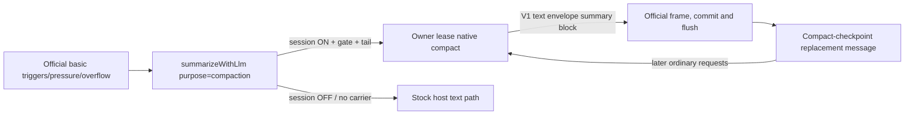

# Official-basic native compaction architecture

`dsh-codex-compaction` `0.3.0-rc.1` keeps the stock official `BasicCompactionEngine`
as the primary and only automatic compaction backend and adds an optional
account-owned native summarization/replay seam for standard `openai-codex` sessions,
plus the legacy structured reader. The earlier A/B experiment established engineering
feasibility, not a product choice; the structured B direction is now **legacy
compatibility** for pre-existing sessions, not the production path.

## Modules and ownership

1. **Account-owned Codex Runtime** (`dsh-token-usage/lib/capabilities/codex-native`):
   the existing OAuth owner callbacks, immutable connection handles, the pinned native
   catalog with trusted model-facts resolution, normal/native protocol, codec, replay,
   disclosed estimates and the metadata-only `applicability` verdict. No raw
   credentials leave the capability.
2. **Standard-route seam** (`native-seam.js`, `preference-recovery.js`): intercepts
   the official engine's `purpose=compaction` `llm/stream` call per session,
   recognizes only the real official basic instruction tail, binds one owner lease
   (same account/model/endpoint) and allows at most one transparent text fallback
   per recoverable native failure inside that lease. Histories containing native
   carriers fail closed on every guard branch — they never reach the plain adapter.
   Session preferences survive host restarts by reading the host's own persisted
   public command lifecycle events only.
3. **DSH provider bridge** (`provider-entry.js`, `runtime-adapter.js`,
   `runtime-service.js`): generic public PiAiAdapter conversion, typed source
   validation, unpredictable replay placeholders and the isolated legacy route
   registration. No native SDK, login, HTTP endpoint or credential store exists in
   production compaction source.
4. **Policy entry** (`index.js`): `/codex-native on|off|inherit|status`,
   `/codex-context` (honest observed logical replacement, never an independent
   disk-persistence claim) and the legacy setup command for the archived B preset.
   It can unload without withdrawing the separately mounted provider entry.
5. **Legacy structured engine** (`structured-engine.js`): the archived B backend for
   pre-existing structured sessions — manual-only, `source.nativeCodex` records,
   unchanged behavior.
6. **Host adapters** (`compatibility.js`, `engine-host.js`): public DSH imports and
   the pinned host contract. No private src/lib imports, global fetch replacement or
   core patches.

The package still ships the provider bridge and policy entry together as separate
Cordis rows: logical separation first, not a claim that uninstalling the whole
package keeps the route reader available.

## Standard-route flow

## Native state

The native summary is the owner codec's existing versioned **V1 text envelope**,
committed by official basic as an ordinary compact-checkpoint message. Detection is
prefix-strict on compact-checkpoint messages; detection and validation remain
separate, so damaged or future payloads fail closed instead of becoming ordinary
text. The legacy structured engine keeps `source.nativeCodex` records for
pre-existing B sessions; both readers stay available and old logs are never
rewritten.

## Trusted model facts and applicability

Custom models (e.g. `gpt-6-astra`) resolve per `open` through the account's trusted
`createCodexModelFacts` seam: whitelisted public host-configured profile fields
(`id`/`name`/`contextWindow`/`maxTokens`/`input`/`reasoningEfforts`) with the
host-resolved model info as a cross-check. Conflicts, invalid values and
unconfigured ids are fixed-vocabulary gaps (`METADATA_CONFLICT`, `PROFILE_INVALID`,
`UNKNOWN_MODEL`, …); nothing is invented. Pinned catalog entries such as
`gpt-5.6-sol` honor configured per-field overrides.

`applicability({ provider, model, signal })` is a metadata-only verdict bounded by
the runtime deadline, caller cancellation and disposal. It never resolves
authentication or performs network I/O and reports fixed reason codes.

## Version and release posture

Release-candidate pair: `dsh-codex-compaction` `0.3.0-rc.1` + `dsh-token-usage`
`5.1.0-rc.1`, both **release candidates, not stable releases**. DSH host `0.1.2-rc.1`; the auth SDK
`0.82.1` stays unchanged and the native protocol module uses the pinned `0.84.4`
alias. The account workspace's `node_modules` points at the live Web profile, so
dependency installation and account testing happen only in isolated source
snapshots.

## Verification posture

This RC is verified **offline only**: unit, frozen legacy-A, comparison, installer
isolation and paired cross-plugin suites run with fake auth/transport and synthetic
data. Live native `gpt-6-astra`/`gpt-5.6-sol` runs, GUI activation and real-account
behavior remain parent-gated acceptance and are NOT yet verified. The profile native
default stays **off** in the RC; enabling it is a reviewed rollout step.

The frozen A code/tests and original comparison evidence stay under `experiments`
as archived evidence, not shipped as a credential fallback.